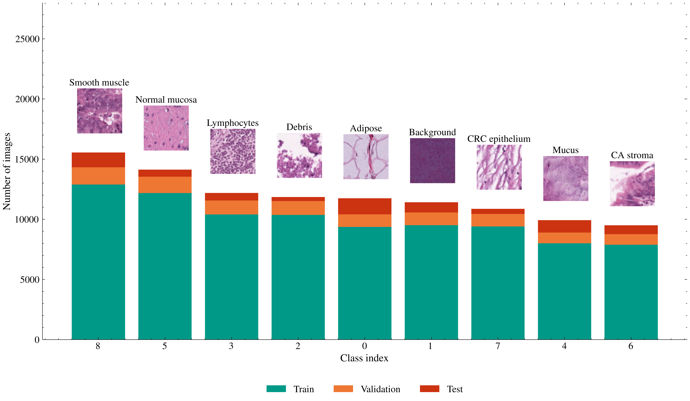
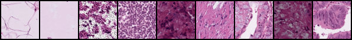
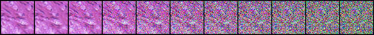
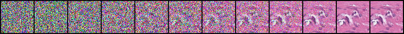
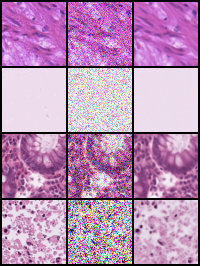

# MedSyn: Class-Conditional Diffusion Models for Medical Image Synthesis

[](https://www.python.org/downloads/)
[](https://pytorch.org)
[](LICENSE)

**MedSyn** is a comprehensive framework for medical image synthesis using **Class-Conditional Denoising Diffusion Probabilistic Models (ccDDPM)**. This repository implements state-of-the-art diffusion models specifically designed for generating high-quality synthetic medical images with class conditioning, addressing the critical challenge of class imbalance in medical imaging datasets.

<div align="center">
  
  <p><em>Figure 1: Class distribution across train, validation, and test splits in the PathMNIST dataset, showing significant class imbalance that motivates the use of synthetic image generation.</em></p>
</div>

---

## Table of Contents

- [Overview](#overview)
- [Key Features](#key-features)
- [Architecture](#architecture)
- [Installation](#installation)
- [Quick Start](#quick-start)
  - [1. Data Preparation](#1-data-preparation)
  - [2. Configuration](#2-configuration)
  - [3. Training](#3-training)
  - [4. Image Generation](#4-image-generation)
- [SLURM Cluster Deployment](#slurm-cluster-deployment)
- [Model Architecture Details](#model-architecture-details)
- [Results and Visualization](#results-and-visualization)
- [Advanced Usage](#advanced-usage)
- [Citation](#citation)
- [License](#license)
- [Authors](#authors)

---

## Overview

Medical image datasets frequently suffer from severe class imbalance, where minority classes (e.g., rare pathologies) are significantly underrepresented. This imbalance can lead to biased machine learning models with poor performance on critical minority classes. **MedSyn** addresses this challenge by implementing a class-conditional diffusion model capable of generating realistic synthetic images for any specified class.

### Key Capabilities

- **Class-Conditional Generation**: Generate synthetic images conditioned on specific tissue types or pathology classes
- **High-Quality Synthesis**: Leverages diffusion models with 1000-step denoising for superior image quality
- **Classifier-Free Guidance**: Implements CFG for enhanced conditioning strength and image fidelity
- **Multi-GPU Support**: Distributed training with PyTorch DDP and parallel generation
- **HPC Integration**: Production-ready SLURM scripts for cluster deployment
- **Comprehensive Monitoring**: Training metrics, visualization, and early stopping

---

## Key Features

### 🎯 **State-of-the-Art Architecture**
- Diffusers UNet2D backbone with learned class embeddings
- Channel concatenation for robust class conditioning
- Exponential Moving Average (EMA) for stable training
- Min-SNR loss weighting for improved convergence

### 🚀 **Production-Ready Training**
- Distributed Data Parallel (DDP) for multi-GPU training
- Mixed-precision training with automatic gradient scaling
- Advanced data augmentation with Albumentations
- Per-class loss tracking and diagnostics
- Early stopping with configurable patience

### 🎨 **Flexible Generation Pipeline**
- Batch generation for maximum GPU utilization
- Parallel multi-GPU generation with work queue distribution
- Denoising process visualization
- Multiple output formats (PNG, NPZ, JSON index)
- CFG scale adjustment for quality-diversity trade-off

### 📊 **Comprehensive Evaluation**
- Training metrics: MSE, PSNR, SSIM
- Generation quality assessment
- Per-class statistics and visualization
- CSV logging for experiment tracking

---

## Architecture

<div align="center">
  
  <p><em>Figure 2: Representative sample images from each of the 9 tissue classes in PathMNIST.</em></p>
</div>

### ccDDPM Model Components

The **Class-Conditional DDPM** consists of three main components:

1. **UNet2D Backbone** (from Diffusers library)
   - Denoising diffusion model architecture
   - Multi-scale feature extraction with skip connections
   - Self-attention mechanisms for global context

2. **Class Embedder**
   - Learnable embedding layer mapping class indices to dense vectors
   - Embedding dimension: 16-32 (configurable)
   - Spatially broadcast embeddings concatenated with image features

3. **Noise Scheduler**
   - DDPM scheduler with configurable timesteps (default: 1000)
   - Squared cosine schedule for stable signal-to-noise ratio
   - Support for DDIM acceleration during inference

### Training Process

```
Input Image (x₀) + Class Label (y)
         ↓
    Add Noise (t ~ U[0,T])
         ↓
    Noisy Image (xₜ)
         ↓
    Class Embedding (emb_y)
         ↓
    Concatenate [xₜ, emb_y]
         ↓
    UNet2D (θ)
         ↓
    Predict Noise (ε_θ)
         ↓
    MSE Loss: ||ε - ε_θ||²
```

<div align="center">
  
  <p><em>Figure 3: Forward diffusion process showing progressive noise addition over timesteps.</em></p>
</div>

### Generation Process

```
Random Noise (x_T) + Target Class (y)
         ↓
    For t = T, ..., 1:
      Class Embedding (emb_y)
      Predict Noise: ε_θ(xₜ, t, y)
      Denoise: xₜ₋₁ = denoise_step(xₜ, ε_θ, t)
         ↓
    Clean Image (x₀)
```

<div align="center">
  
  <p><em>Figure 4: Reverse denoising process generating a clean image from random noise.</em></p>
</div>

---

## Installation

### Prerequisites

- Python 3.9 or higher
- CUDA 11.8+ (for GPU support)
- Conda or virtualenv (recommended)

### Step 1: Clone the Repository

```bash
git clone https://github.com/MarioPasc/medsyn.git
cd medsyn
```

### Step 2: Create Virtual Environment

```bash
# Using conda (recommended)
conda create -n medsyn python=3.10
conda activate medsyn

# Or using venv
python -m venv venv
source venv/bin/activate  # Linux/Mac
# venv\Scripts\activate  # Windows
```

### Step 3: Install Dependencies

```bash
# Install in development mode
pip install -e .

# Or install from PyPI (when available)
# pip install medsyn
```

### Step 4: Verify Installation

```bash
# Check available commands
ccddpm-train --help
ccddpm-generate --help

# Test PyTorch CUDA availability
python -c "import torch; print(f'CUDA available: {torch.cuda.is_available()}')"
python -c "import torch; print(f'GPU count: {torch.cuda.device_count()}')"
```

---

## Quick Start

### 1. Data Preparation

MedSyn supports the **MedMNIST** family of medical imaging datasets. We demonstrate using **PathMNIST** (colon pathology images).

#### Download PathMNIST Dataset

```bash
# Using the built-in data preparation tool
medsyn-prepare-data --dataset pathmnist --output-dir ./data

# Or manually download with Python
python -c "
from medmnist import PathMNIST
import numpy as np

# Download and save as NPZ
train = PathMNIST(split='train', download=True)
val = PathMNIST(split='val', download=True)
test = PathMNIST(split='test', download=True)

# Save to single NPZ file
np.savez('./data/PathMNIST.npz',
         train_images=train.imgs,
         train_labels=train.labels.squeeze(),
         val_images=val.imgs,
         val_labels=val.labels.squeeze(),
         test_images=test.imgs,
         test_labels=test.labels.squeeze())
"
```

#### Dataset Structure

After preparation, your data directory should contain:

```
data/
├── PathMNIST.npz          # Compressed dataset (all splits)
└── pathmnist_index.json   # Optional: index for PNG files
```

**NPZ Format** (recommended):
- `train_images`: (N, 28, 28, 3) uint8 RGB images
- `train_labels`: (N,) int64 class labels [0-8]
- Similar for `val_*` and `test_*` splits

### 2. Configuration

Create or modify a YAML configuration file. A template is provided in `config/picasso_cfg.yaml`.

#### Minimal Configuration Example

```yaml
# config/my_config.yaml

data:
  flag: pathmnist
  size: 64  # Resize images to 64x64
  postprocess_npz:
    enabled: true
    npz_path: /absolute/path/to/PathMNIST.npz
  num_workers: 4

ccddpm:
  dist:
    enabled: false  # Set to true for multi-GPU
    backend: nccl

  dataloader:
    type: npz  # Use NPZ dataloader

  train:
    image_size: 64
    in_channels: 3
    class_embed_dim: 32
    num_classes: 9  # PathMNIST has 9 tissue types
    batch_size: 32
    epochs: 100
    mixed_precision: true
    grad_clip_norm: 10.0
    guidance_p_uncond: 0.1  # 10% unconditional for CFG
    ema_use: true
    ema_decay: 0.999
    patience: 15
    output_dir: ./outputs/ccddpm

  optim:
    lr: 2.0e-4
    wd: 0.0

  sched:
    num_train_timesteps: 1000
    beta_start: 1.0e-4
    beta_end: 2.0e-2
    beta_schedule: squaredcos_cap_v2

  infer:
    guidance_scale: 2.0
    num_inference_steps: 1000

generate:
  model_type: ccddpm
  checkpoint: ./outputs/ccddpm/ckpts/best.pt
  npz_with_synth_images:
    save_to: ./outputs/synth
    train:
      classes:
        0: 1000  # Generate 1000 images for class 0
        1: 1000
        2: 1000
        # ... specify for all classes
```

#### Using Environment Variables

Configurations support environment variable expansion:

```yaml
data:
  postprocess_npz:
    npz_path: ${DATASET_PATH}  # Expands from environment

ccddpm:
  train:
    output_dir: ${OUTPUT_DIR}  # Expands from environment
```

Set these before training:
```bash
export DATASET_PATH=/path/to/PathMNIST.npz
export OUTPUT_DIR=/path/to/outputs
```

### 3. Training

#### Single-GPU Training

```bash
ccddpm-train config/my_config.yaml
```

#### Multi-GPU Training (Distributed Data Parallel)

For multi-GPU training, use `torchrun`:

```bash
# Train on 4 GPUs
torchrun --standalone --nnodes=1 --nproc_per_node=4 \
  -m medsyn.cli.train_ccDDPM config/my_config.yaml
```

#### Training with CLI Overrides

```bash
# Override dataset and output paths
ccddpm-train config/my_config.yaml \
  --dataset /path/to/data.npz \
  --outdir /path/to/outputs
```

#### Monitor Training

Training outputs:
- **Checkpoints**: `outputs/ccddpm/ckpts/`
  - `best.pt`: Best model by validation loss
  - `last.pt`: Latest epoch
  - `epoch_XXXX.pt`: Periodic checkpoints
- **Logs**: `outputs/ccddpm/training_metrics.csv`
- **Visualizations**: `outputs/ccddpm/figures/`

<div align="center">
  
  <p><em>Figure 5: Reconstruction quality visualization during training. Original images (left column in each pair), reconstructions (right column with noise overlay).</em></p>
</div>

### 4. Image Generation

#### Single-GPU Generation

```bash
ccddpm-generate config/my_config.yaml
```

This reads the `generate` section of your config and produces synthetic images.

#### Parallel Multi-GPU Generation

For faster generation across multiple GPUs:

```bash
python -m medsyn.cli.generate_ccDDPM_parallel \
  config/my_config.yaml \
  --num-gpus 4 \
  --batch-size 4
```

Performance notes:
- **Batch generation**: 3-4x speedup over single-image generation
- **Multi-GPU**: Linear scaling (4 GPUs ≈ 4x speedup)
- **Memory**: ~1GB per GPU with batch_size=4

#### Generation Outputs

```
outputs/synth/
├── train/
│   ├── class_0/
│   │   ├── synth_<uuid>_class0.png
│   │   ├── ...
│   ├── class_1/
│   │   └── ...
│   ├── train_index.json          # JSON index of all images
│   └── PathMNIST_train_synth.npz # Compressed NPZ format
├── val/
│   └── ...
└── denoising_visualizations/     # Denoising process videos/grids
```

#### Generation Configuration

Specify per-class image counts in your config:

```yaml
generate:
  checkpoint: ./outputs/ccddpm/ckpts/best.pt
  npz_with_synth_images:
    save_to: ./outputs/synth
    train:
      classes:
        0: 3519  # Balance to match majority class
        1: 3376
        2: 2525
        3: 2484
        4: 4879
        5: 703   # Undersample majority class
        6: 4999
        7: 3484
        8: 100   # Oversample minority class
    val:
      classes:
        0: 391
        1: 375
        # ...
```

---

## SLURM Cluster Deployment

MedSyn includes production-ready SLURM scripts for HPC environments.

### Training on SLURM

#### Single-GPU Training

```bash
sbatch scripts/picasso_sbatch.sh
```

**Script configuration** (`scripts/picasso_sbatch.sh`):
```bash
#SBATCH -J ccddpm_pathmnist
#SBATCH --time=08:00:00
#SBATCH --ntasks=1
#SBATCH --cpus-per-task=8
#SBATCH --mem=64G
#SBATCH --gres=gpu:1

# Modify these paths in the script
DATA_SRC="/path/to/PathMNIST.npz"
REPO_SRC="/path/to/medsyn"
RESULTS_DST="/path/to/results"
```

#### Multi-GPU Training

For DDP training on multiple GPUs:

```bash
sbatch scripts/picasso_multi_gpu_sbatch.sh
```

Key settings:
```bash
#SBATCH --gres=gpu:4          # Request 4 GPUs
#SBATCH --cpus-per-task=32    # 8 CPUs per GPU
#SBATCH --mem=256G            # 64GB per GPU
```

### Parallel Generation on SLURM

```bash
sbatch scripts/picasso_generate_parallel_sbatch.sh
```

**Configuration highlights**:
- Automatic work distribution across GPUs
- LocalScratch optimization for I/O performance
- Automatic results synchronization to permanent storage
- Comprehensive logging and error handling

**Script features**:
```bash
#SBATCH --gres=gpu:4
#SBATCH --time=23:00:00
#SBATCH --cpus-per-task=16

NUM_GPUS=${SLURM_GPUS_ON_NODE:-4}
CHECKPOINT_SRC="/path/to/best.pt"
RESULTS_DST="/path/to/generated_images"
```

### SLURM Job Management

```bash
# Submit job
sbatch scripts/picasso_sbatch.sh

# Check job status
squeue -u $USER

# View output logs
tail -f ccddpm_pathmnist.<job_id>.out
tail -f ccddpm_pathmnist.<job_id>.err

# Cancel job
scancel <job_id>
```

---

## Model Architecture Details

### Class Embedder

The `ClassEmbedder` module creates learnable representations for each class:

```python
# From medsyn/models/ccDDPM/model.py
ClassEmbedder(
    num_classes=9,        # 9 tissue types in PathMNIST
    embed_dim=32,         # Embedding dimension
    label_for_uncond=-1   # Special token for CFG
)
```

**Implementation**:
- `nn.Embedding(num_classes + 1, embed_dim)` for learned embeddings
- Spatial broadcasting: `(B, D) → (B, D, H, W)`
- Channel concatenation with noisy image: `[x_t, emb_y]`

### UNet2D Architecture

```python
UNet2DModel(
    sample_size=64,              # Image resolution
    in_channels=35,              # 3 (RGB) + 32 (class embedding)
    out_channels=3,              # Predict RGB noise
    layers_per_block=2,
    block_out_channels=(128, 256, 512, 512),
    down_block_types=(
        "DownBlock2D",
        "DownBlock2D",
        "AttnDownBlock2D",       # Attention at 16x16
        "DownBlock2D",
    ),
    up_block_types=(
        "UpBlock2D",
        "AttnUpBlock2D",         # Attention at 16x16
        "UpBlock2D",
        "UpBlock2D",
    ),
)
```

### Training Objective

The training loss combines:

1. **MSE Noise Prediction Loss**:
   ```
   L = 𝔼_{x₀,ε,t,y} [||ε - ε_θ(√ᾱₜ x₀ + √(1-ᾱₜ) ε, t, y)||²]
   ```

2. **Min-SNR Weighting** (optional, enabled by default):
   ```
   w(t) = min(SNR(t), γ) / SNR(t)
   ```
   - Stabilizes training across timesteps
   - `γ = 5.0` by default

3. **Classifier-Free Guidance** (during training):
   - 10% of training samples use unconditional label (`y = -1`)
   - Enables guidance scale adjustment during generation

### Inference Algorithm

**Classifier-Free Guidance** sampling:

```python
for t in reversed(range(T)):
    # Conditional prediction
    ε_cond = model(x_t, t, y=target_class)

    # Unconditional prediction
    ε_uncond = model(x_t, t, y=-1)

    # Guided prediction
    ε = ε_uncond + guidance_scale * (ε_cond - ε_uncond)

    # Denoising step
    x_{t-1} = scheduler.step(ε, t, x_t).prev_sample
```

**Guidance scale effects**:
- `guidance_scale = 1.0`: No guidance (standard sampling)
- `guidance_scale = 1.5-2.0`: Enhanced conditioning, better class alignment
- `guidance_scale > 3.0`: Stronger conditioning, may reduce diversity

---

## Results and Visualization

### Training Metrics

Training produces comprehensive metrics saved to `training_metrics.csv`:

| Epoch | Train Loss | Val Loss | PSNR | SSIM | LR | Time |
|-------|-----------|----------|------|------|-----|------|
| 1     | 0.0234    | 0.0245   | 18.2 | 0.65 | 2e-4 | 120s |
| 10    | 0.0089    | 0.0091   | 24.5 | 0.82 | 2e-4 | 115s |
| 30    | 0.0034    | 0.0036   | 28.9 | 0.89 | 2e-4 | 112s |

### Visualization Gallery

The training pipeline generates diagnostic visualizations:

1. **Per-Class Samples** (`epoch_XXXX_classes.png`)
   - Random samples from each class
   - Monitors class-specific quality

2. **Reconstruction Quality** (`epoch_XXXX_recon.png`)
   - Original vs. reconstructed images
   - Assesses model capacity

3. **Noising Process** (`epoch_XXXX_noising.png`)
   - Forward diffusion visualization
   - Debugging tool for scheduler

4. **Denoising Process** (`epoch_XXXX_denoising.png`)
   - Reverse sampling steps
   - Quality assessment tool

### Generation Quality

**Denoising visualization** during generation:
- Saved as grids showing progressive denoising
- Random samples per class
- Useful for qualitative assessment

---

## Advanced Usage

### Custom Augmentation

Configure augmentation in YAML:

```yaml
ccddpm:
  augmentation:
    enabled: true
    probability: 0.6  # Apply to 60% of images
    preserve_range: true
    transforms:
      - name: HorizontalFlip
        p: 0.5
      - name: VerticalFlip
        p: 0.5
      - name: Rotate
        p: 0.3
        limit: 10  # ±10 degrees
      - name: RandomBrightnessContrast
        p: 0.2
        brightness_limit: 0.2
        contrast_limit: 0.2
      - name: GaussNoise
        p: 0.1
        var_limit: [10.0, 30.0]
```

### Fine-Tuning from Checkpoint

Resume training from a checkpoint:

```python
# In your config or training script
from medsyn.models.ccDDPM.engine.train import train
from medsyn.models.ccDDPM.config import load_cfg

cfg = load_cfg("config/my_config.yaml")
cfg.ccddpm.train.resume_from = "./outputs/ccddpm/ckpts/epoch_0050.pt"

train(cfg)
```

### Custom Dataset Integration

To use your own dataset:

1. **Prepare NPZ format**:
```python
import numpy as np

np.savez('my_dataset.npz',
         train_images=train_imgs,  # (N, H, W, 3) uint8
         train_labels=train_labels, # (N,) int64
         val_images=val_imgs,
         val_labels=val_labels,
         test_images=test_imgs,
         test_labels=test_labels)
```

2. **Update config**:
```yaml
data:
  postprocess_npz:
    npz_path: /path/to/my_dataset.npz
  size: 64  # Resize to your desired resolution

ccddpm:
  train:
    num_classes: <your_num_classes>
```

3. **Train**:
```bash
ccddpm-train config/my_config.yaml
```

### Programmatic API

Use MedSyn programmatically:

```python
from medsyn.models.ccDDPM.config import load_cfg
from medsyn.models.ccDDPM.engine.train import train
from medsyn.models.ccDDPM.model import CCDDPM, CCDDPMInit
import torch

# Load configuration
cfg = load_cfg("config/my_config.yaml")

# Train model
train(cfg)

# Or load trained model for inference
device = torch.device("cuda")
init_args = CCDDPMInit(
    in_channels=3,
    num_classes=9,
    class_embed_dim=32,
    image_size=64,
    num_train_timesteps=1000,
)
model = CCDDPM(init_args).to(device)
checkpoint = torch.load("outputs/ccddpm/ckpts/best.pt")
model.load_state_dict(checkpoint['model_state_dict'])

# Generate images
with torch.no_grad():
    synthetic_images = model.sample(
        batch_size=16,
        class_labels=torch.tensor([0]*16).to(device),
        guidance_scale=2.0,
        num_inference_steps=1000
    )
```

### Hyperparameter Tuning

Key hyperparameters to tune:

| Parameter | Range | Impact |
|-----------|-------|--------|
| `learning_rate` | 1e-5 to 5e-4 | Training speed and stability |
| `batch_size` | 16-128 | Memory usage and gradient noise |
| `guidance_scale` | 1.0-3.0 | Conditioning strength vs. diversity |
| `class_embed_dim` | 16-64 | Class representation capacity |
| `guidance_p_uncond` | 0.05-0.2 | CFG training ratio |
| `ema_decay` | 0.995-0.9999 | EMA smoothness |

**Recommended starting points**:
- Small datasets (< 10k images): `lr=1e-4`, `batch_size=32`
- Large datasets (> 50k images): `lr=2e-4`, `batch_size=64`
- High-resolution (> 128px): Reduce `lr` by 50%, increase `ema_decay`

---

## Citation

If you use MedSyn in your research, please cite:

```bibtex
@software{medsyn2024,
  author = {Pascual-González, M. and Cebolla Salas, Martina},
  title = {MedSyn: Class-Conditional Diffusion Models for Medical Image Synthesis},
  year = {2024},
  publisher = {GitHub},
  url = {https://github.com/MarioPasc/medsyn}
}
```

**Related work**:
- **DDPM**: Ho et al. (2020). "Denoising Diffusion Probabilistic Models." NeurIPS.
- **Classifier-Free Guidance**: Ho & Salimans (2022). "Classifier-Free Diffusion Guidance." NeurIPS Workshop.
- **MedMNIST**: Yang et al. (2021). "MedMNIST Classification Decathlon: A Lightweight AutoML Benchmark for Medical Image Analysis." ISBI.
- **PathMNIST**: Derived from Kather et al. (2016). "Multi-class texture analysis in colorectal cancer histology." Nature Scientific Reports.

---

## License

This project is licensed under the MIT License - see the [LICENSE](LICENSE) file for details.

---

## Authors

**M. Pascual-González**
📧 Email: [mpascual@uma.es](mailto:mpascual@uma.es)
🔗 GitHub: [@MarioPasc](https://github.com/MarioPasc)

**Martina Cebolla Salas**
📧 Email: [martinacesalas@gmail.com](mailto:martinacesalas@gmail.com)

---

## Acknowledgments

- **MedMNIST** team for providing standardized medical imaging benchmarks
- **Hugging Face Diffusers** library for the UNet2D implementation
- **PyTorch** team for the deep learning framework
- High-Performance Computing resources at Universidad de Málaga

---

## Contributing

Contributions are welcome! Please feel free to submit a Pull Request. For major changes, please open an issue first to discuss what you would like to change.

**Development setup**:
```bash
git clone https://github.com/MarioPasc/medsyn.git
cd medsyn
pip install -e ".[dev]"
pre-commit install
```

---

## Support

For questions and support:
- 📝 Open an issue: [GitHub Issues](https://github.com/MarioPasc/medsyn/issues)
- 💬 Discussions: [GitHub Discussions](https://github.com/MarioPasc/medsyn/discussions)
- 📧 Email: [mpascual@uma.es](mailto:mpascual@uma.es)

---

<div align="center">
  <p><strong>Built with ❤️ for the medical imaging research community</strong></p>
  <p><em>Advancing healthcare through AI-powered synthetic data generation</em></p>
</div>
